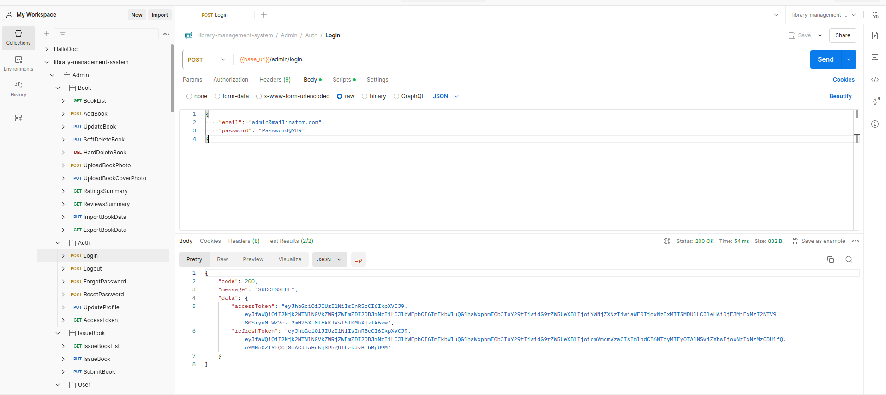
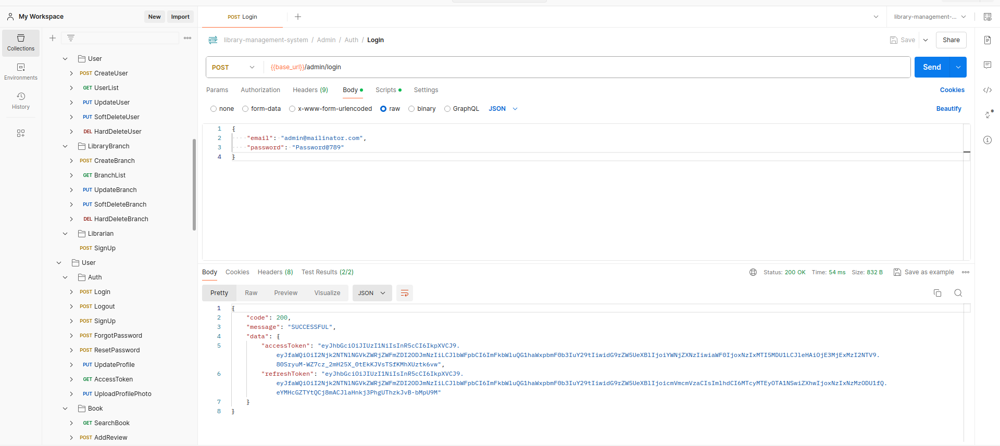
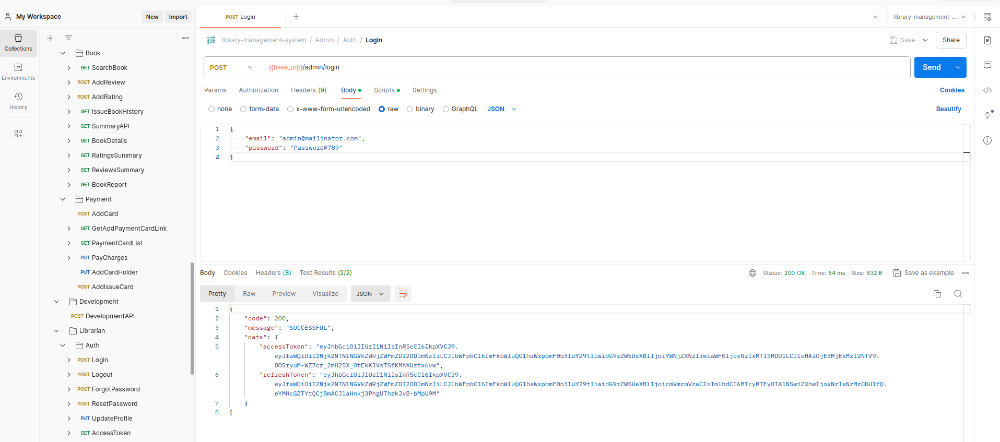
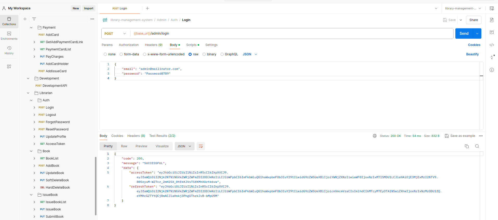

# Trainee Project

# Library Management System

## Description

This project is a library management system designed to facilitate efficient administration, and user interactions with library resources. It includes separate modules for administrators, librarians and users, each with specific functionalities and access levels. Users can manage their book interactions through a user API, while administrators have broader control over library operations, librarian and user management whereas librarians can efficienly manage resources in their respective library branches.

## Badges

[](https://opensource.org/licenses/ISC)

## Visuals

`Screenshots of postman collection for getting visual interpretation of the API's which you can integrate in your front-end.`

- 
- 
- 
- 

## Installation

To install and run the project locally, follow these steps:

1. Clone the repository:

   ```bash
   git clone https://github.com/ataavohra-tatvasoft/library-management-system.git
   ```

2. Install dependencies:
   `npm install`
3. Set up environment variables (if required).

4. Lint the code and solve linting errors
   `npm run lint` & `npm run lint:fix`

5. Seed the database:
   `npm run seed`

6. Run development API if sample data needed:
   `{{base_url}}/development/development-api`

7. Build the project:
   `npm run build`

8. Start the server:

   \*With nodemon
   `npm run dev:watch`

   \*Without nodemon
   `npm run dev`

## Usage

- Admin Module:

  - Registering and managing users.
  - Managing books (add, update, delete).
  - Managing book issues and returns.
  - Uploading book photos.
  - Get detailed analysis of books.
  - Importing/exporting data from Google Sheets.
  - Add, update and delete library branch as well librarian.
  - Admin authentication and profile management.

- User Module:

  - Searching and browsing books in their respective branch.
  - Issuing and returning books through librarian.
  - Writing reviews and rate books.
  - Get detailed report on their issued book history as well as detailed information about book.
  - Managing personal profiles and payment information.
  - User authentication and profile management.

- Librarian Module:
  - Add, update and delete books in their library branch.
  - Issuing and returning books for users.
  - Managing personal profile information.
  - Librarian authentication and profile management.

## Support

- Upcoming features and improvements:

  - Enhanced user interface.
  - Integration with external library systems.
  - Advanced analytics and reporting.

## Contributing

- We welcome contributions! Please follow these guidelines:

  - Fork the repository and create your branch from main.
  - Ensure your code follows our coding standards.
  - Submit a pull request detailing your changes.

## Authors and acknowledgment

`Ataa Vohra - Lead Developer`

## License

`This project is licensed under the ISC License. See the LICENSE file for details.`

## Project status

`Development is ongoing with regular updates and improvements.`
